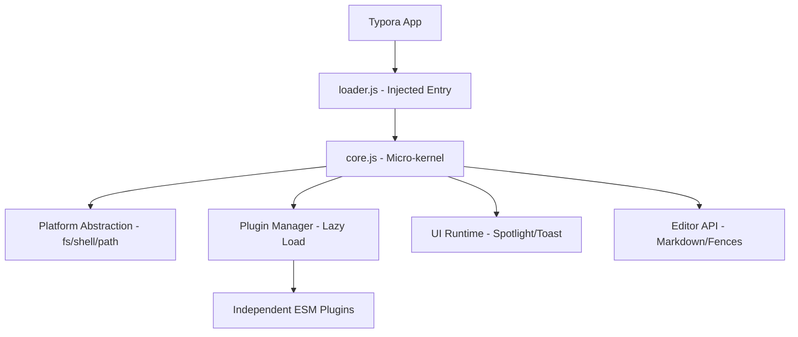

# typora-plugin-lite (tpl)

**typora-plugin-lite** (abbreviated as **tpl**) is a lightweight, cross-platform, and minimal-invasiveness plugin system for [Typora](https://typora.io/). 

It is designed to solve the cross-platform compatibility issues of existing plugin systems, particularly on macOS where Typora is a native Swift/WKWebView application rather than Electron.

> [!WARNING]
> **Under active development.** Use at your own risk. The architecture and APIs are subject to change without notice.

---

## 🚀 Key Features

- **Cross-Platform First**: Unified abstraction layer for macOS (WKWebView) and Windows/Linux (Electron).
- **Micro-kernel Architecture**: A minimal `loader.js` (approx. 30 lines) triggers a dynamic ESM `core.js`.
- **Lazy Loading**: Plugins are only loaded when triggered by startup, events, commands, or hotkeys (inspired by `lazy.nvim`).
- **Standard-Compatible Metadata**: Uses YAML frontmatter and HTML comments (`tpl` markers) to store plugin data, ensuring zero conflict with other Markdown renderers.
- **Spotlight UI**: A decoupled, high-performance UI runtime for search, commands, and navigation.
- **External Storage**: All plugin data and configurations are stored in the system application support directory, keeping your Typora installation clean.

---

## 🏗️ Architecture



### Platform Abstraction
Plugins never touch low-level APIs directly. They use `platform.fs`, `platform.shell`, and `platform.path`, which automatically switch between:
- **macOS**: `bridge.callHandler` and shell command execution.
- **Win/Linux**: Node.js `fs`, `path`, and `child_process` modules.

---

## 📦 Included Plugins

| Plugin | Complexity | Strategy | Description |
|--------|------------|----------|-------------|
| `md-padding` | S | `startup` | Automatically format Chinese/English spacing. |
| `fence-enhance` | S | `startup` | Add copy button to code fences. |
| `sidenote` | M | `startup` | Render inline `<span class="sidenote">` as margin notes inside the editor. |
| `wider` | M | `startup` | Switch editor width between `default / wide / full` with sidenote-aware spacing. |
| `title-shift` | S | `hotkey` | Quickly shift heading levels. |
| `fuzzy-search` | M | `hotkey` | Quick-open with fzf-style ranking, relative-path matching, and rg/fallback indexing. |
| `note-assistant` | M | `hotkey` | Show graph-based related notes and insert wiki-links from the current document. |

### `wider` at a glance

- Feishu-like `default / wide / full` writing widths
- `Mod+[` narrows, `Mod+]` widens
- Shortcut-only switching with a brief mode toast
- Auto-reserves the sidenote gutter when `sidenote` is active

### `sidenote` table behavior

- Desktop sidenotes are rendered into a dedicated right-side portal layer in the editor
- Table horizontal scrolling remains intact
- Sidenotes stay docked on the outer editor gutter instead of participating in block layout

---

## 🛠️ Installation

### Prerequisites

- [Typora](https://typora.io/) installed
- [Node.js](https://nodejs.org/) (v18+) and [pnpm](https://pnpm.io/) for building from source

### Step 1: Clone & Build

```bash
git clone https://github.com/AcademicDog/typora-plugin-lite.git
cd typora-plugin-lite
pnpm install
pnpm build
```

### Step 2: Run Installer

The installer automatically detects your Typora installation, backs up `window.html`, injects the loader script, and copies plugin files into Typora's resources directory.

<details>
<summary><strong>macOS</strong></summary>

```bash
./packages/installer/install.sh
```

The script searches these default locations:
- `/Applications/Typora.app`

If Typora is installed elsewhere:
```bash
./packages/installer/install.sh -p /path/to/Typora.app
```

> **Note:** On macOS, the installer will re-sign the app bundle to maintain code signature validity. You may be prompted for your password.

</details>

<details>
<summary><strong>Linux</strong></summary>

```bash
sudo ./packages/installer/install.sh
```

`sudo` is required because Typora's resources directory (e.g. `/usr/share/typora/resources/`) is typically owned by root.

The script searches these default locations:
- `/usr/share/typora`
- `/usr/local/share/typora`
- `/opt/typora`
- `~/.local/share/Typora`

If Typora is installed elsewhere:
```bash
sudo ./packages/installer/install.sh -p /path/to/typora
```

</details>

<details>
<summary><strong>Windows</strong></summary>

Open **PowerShell as Administrator**, then run:
```powershell
powershell -ExecutionPolicy Bypass -File packages\installer\bin\install-windows.ps1
```

The script searches these default locations:
- `C:\Program Files\Typora`
- `C:\Program Files (x86)\Typora`
- `%LOCALAPPDATA%\Programs\Typora`
- Windows Registry install records

If Typora is installed elsewhere:
```powershell
powershell -ExecutionPolicy Bypass -File packages\installer\bin\install-windows.ps1 -Path "D:\Apps\Typora"
```

> **Note:** Administrator privileges are needed to write to Typora's installation directory.

</details>

### Step 3: Restart Typora

Close and reopen Typora. Open DevTools (`Shift+F12` on Linux/Windows, or `Option+Command+I` on macOS) and check the console for:
```
[tpl:loader] done
```

### Uninstall

Restore the original `window.html` from backup:
```bash
# The backup is at: <typora-resources>/window.html.tpl-backup
# Linux example:
sudo cp /usr/share/typora/resources/window.html.tpl-backup /usr/share/typora/resources/window.html
```

Or simply reinstall/update Typora — the plugin injection will be replaced by the fresh `window.html`.

---

## 🤝 Contributing

We welcome contributions of all kinds! Whether it's reporting a bug, suggesting a feature, or submitting a pull request, your help is appreciated.

1.  **Report Issues**: Found a bug? Open an [issue](https://github.com/your-username/typora-plugin-lite/issues).
2.  **Submit PRs**: Feel free to fork and submit pull requests. Please follow the existing code style.
3.  **Plugin Development**: Check the `docs/plugin-dev-guide.md` (coming soon) to start building your own plugins.

---

## 📜 License

MIT License. See [LICENSE](LICENSE) for details.
