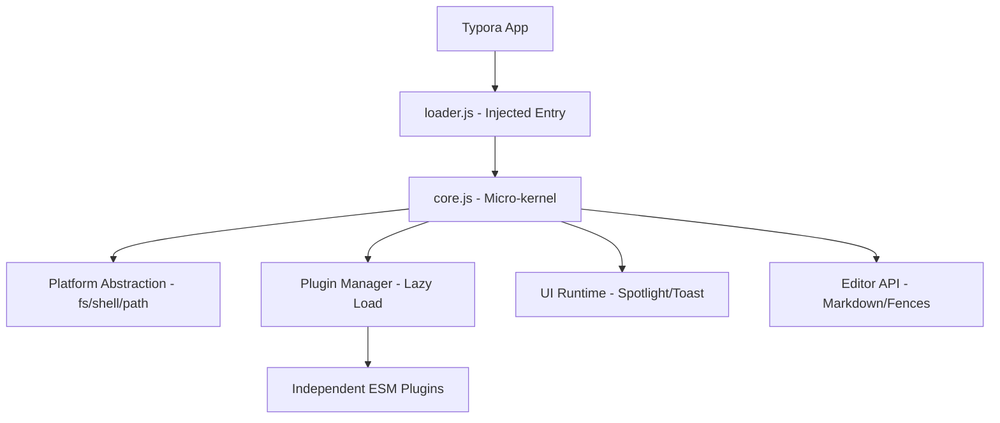

# typora-plugin-lite (tpl)

**typora-plugin-lite** (abbreviated as **tpl**) is a lightweight, cross-platform, and minimal-invasiveness plugin system for [Typora](https://typora.io/). 

It is designed to solve the cross-platform compatibility issues of existing plugin systems, particularly on macOS where Typora is a native Swift/WKWebView application rather than Electron.

> [!WARNING]
> **Under active development.** Use at your own risk. The architecture and APIs are subject to change without notice.

---

## 🚀 Key Features

- **Cross-Platform First**: Unified abstraction layer for macOS (WKWebView) and Windows/Linux (Electron).
- **Micro-kernel Architecture**: A minimal `loader.js` (approx. 30 lines) triggers a dynamic ESM `core.js`.
- **Lazy Loading**: Plugins are only loaded when triggered by startup, events, commands, or hotkeys (inspired by `lazy.nvim`).
- **Standard-Compatible Metadata**: Uses YAML frontmatter and HTML comments (`tpl` markers) to store plugin data, ensuring zero conflict with other Markdown renderers.
- **Spotlight UI**: A decoupled, high-performance UI runtime for search, commands, and navigation.
- **External Storage**: All plugin data and configurations are stored in the system application support directory, keeping your Typora installation clean.

---

## 🏗️ Architecture



### Platform Abstraction
Plugins never touch low-level APIs directly. They use `platform.fs`, `platform.shell`, and `platform.path`, which automatically switch between:
- **macOS**: `bridge.callHandler` and shell command execution.
- **Win/Linux**: Node.js `fs`, `path`, and `child_process` modules.

---

## 📦 Included Plugins

| Plugin | Complexity | Strategy | Description |
|--------|------------|----------|-------------|
| `md-padding` | S | `startup` | Automatically format Chinese/English spacing. |
| `fence-enhance` | S | `startup` | Enhanced code block features (copy button, etc.). |
| `title-shift` | S | `command` | Quickly shift heading levels. |
| `todo-manager` | M | `startup` | Advanced TODO list management. |
| `drawio` | L | `event` | Embed and edit Draw.io diagrams. |
| `timeline` | M | `event` | Render vertical/horizontal timelines. |
| `fuzzy-search` | L | `hotkey` | Global file and content fuzzy search. |
| `recent-files` | S | `startup` | Fast access to recently opened documents. |
| `file-tags` | L | `hotkey` | Tag-based file organization and navigation. |

---

## 🛠️ Installation

### Prerequisites
- [Typora](https://typora.io/) installed.
- [Node.js](https://nodejs.org/) and [pnpm](https://pnpm.io/) for building from source.

### Build from source
```bash
pnpm install
pnpm run build
```

### Run Installer
The installer will automatically detect your OS, inject the loader script into Typora's entry HTML, and handle code signing (on macOS).

**macOS / Linux:**
```bash
./packages/installer/install.sh
```

**Windows (PowerShell):**
```powershell
powershell -ExecutionPolicy Bypass -File packages/installer/bin/install-windows.ps1
```

---

## 🤝 Contributing

We welcome contributions of all kinds! Whether it's reporting a bug, suggesting a feature, or submitting a pull request, your help is appreciated.

1.  **Report Issues**: Found a bug? Open an [issue](https://github.com/your-username/typora-plugin-lite/issues).
2.  **Submit PRs**: Feel free to fork and submit pull requests. Please follow the existing code style.
3.  **Plugin Development**: Check the `docs/plugin-dev-guide.md` (coming soon) to start building your own plugins.

---

## 📜 License

MIT License. See [LICENSE](LICENSE) for details.
